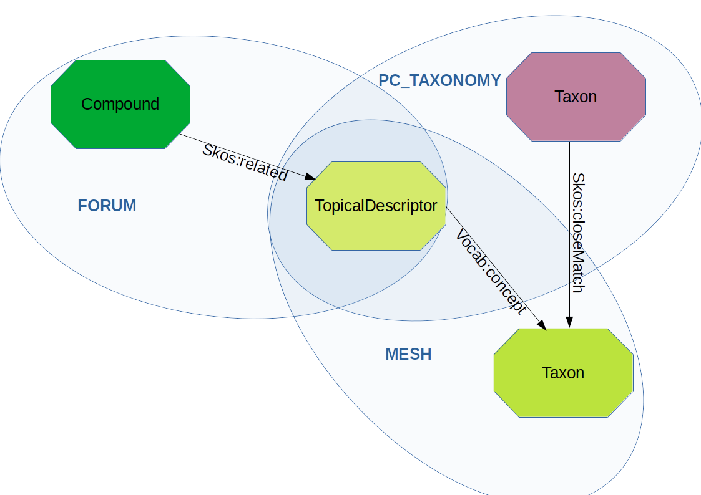

# Atelier Big Data - 10 au 12 janvier 2023 - Hadoop/Spark/RDF

## Objectifs

L'objectif de ce TP est d'intégrer puis d'utiliser des graphes de connaissances (fichier RDF) de plusieurs sources (Mesh, NCBI, FORUM) dans un DataLake et un environnement Spark/Hadoop. 

Nous utiliserons des [commandes Hadoop](https://hadoop.apache.org/docs/current/hadoop-project-dist/hadoop-common/FileSystemShell.html) pour la gestion des fichiers et nous developperons le traitement en language [scala](https://www.scala-lang.org/). 

Pour mettre au point la méthode nous utiliserons un [spark-shell](https://spark.apache.org/docs/latest/quick-start.html) puis nous developperons une application spark pour automatiser le traitement.

## Sujet

Associer un composé référencé dans le projet [FORUM](https://forum-webapp.semantic-metabolomics.fr/#/about) avec un [PubChem/Taxonomy](https://pubchem.ncbi.nlm.nih.gov/source/22056) .



[Les données RDF](./databases.md)


### A - Utilisation d'un  spark-shell pour travailler sur le jeu de données test

Il faut se référer à la partie ["installation"](./prerequisites.md) si vous souhaitez travailler dans un environnement de développement personnel ou sur une machine virtuelle instanciée à partir d'un cloud académique ([orion](https://orion.cloud.inrae.fr/) ou [genostack](https://genostack.genouest.org/) par exemple).


#### Les plateformes d'exécution

- [Cluster de l'atelier](./clustertp.md)
- [Local/Cloud Orion/Cloud Genostack](./local.md)
- [Metabolomics Semantic Datalake](./msd.md)

#### Traitement sur un jeu de données test

Nous allons travailler a partir d'un jeu de données test qui se trouve dans [rdf-files-test](https://github.com/p2m2/tp-big-data-scala-spark-sansa/tree/main/rdf-files-test)


### TP

#### I) Téléchargez le jeux de données puis transferez ces données sur le stockage HDFS  
#### II) lancez un spark-shell en initialisant votre environnement avec la librairie Sansa
##### a) Utilisez la méthode *find* pour extraire le nombre de triplets contenant le prédicat *"http://id.nlm.nih.gov/mesh/vocab#concept"* sur le graphe *mesh_test.nt*.
##### b) Retrouvez cette information en utilisant *statsPropertyUsage*
##### c) En utilisant le package [QualityAssessment](./qualityassessment.md), et les ressources (/rdf/mesh.nt.gz et /rdf/vocabulary_1.0.0.ttl), déterminez :
 
 - *Le ratio entre le nombre d'uri (sujet/predicat/objet) de type HashUri (contenant "#") et le nombre de triplet*
 - *le ratio du nombre de ressource (sujet/predicat/objet) qui est libéllée*


Dans la suite du TP, il s'agira de :

- créer un [*Dataset*](https://spark.apache.org/docs/latest/api/java/index.html?org/apache/spark/sql/Dataset.html) pour chaque fichier RDF ;
- créer un [*Dataset*](https://spark.apache.org/docs/latest/api/java/index.html?org/apache/spark/sql/Dataset.html) commun qui fusionne les trois *Datasets* ;
- exécuter une requete SPARQL sur ce dernier *Dataset* ;
- sauvegarder les resultats au format parquet sur le cluster hdfs dans le repertoire "./results/compound_taxon.parquet" .


#### III) Créer un RDD pour chaque graphe RDF
#### IV) Fusionnez les RDD en un unique RDD
#### V) Appliquez la requete SPARQL suivante sur le RDD fusionné en utilisant *net.sansa_stack.query.spark.sparqlify.QueryEngineFactorySparqlify* et afficher le résultat

```scala
val query = """ 
PREFIX skos: <http://www.w3.org/2004/02/skos/core#>
PREFIX rdf: <http://www.w3.org/1999/02/22-rdf-syntax-ns#>
PREFIX rdfs: <http://www.w3.org/2000/01/rdf-schema#>
PREFIX owl: <http://www.w3.org/2002/07/owl#>
PREFIX meshv: <http://id.nlm.nih.gov/mesh/vocab#>
PREFIX chebi: <http://purl.obolibrary.org/obo/CHEBI_>
PREFIX mesh: <http://id.nlm.nih.gov/mesh/>

SELECT ?compound ?prop ?mesh ?taxon
WHERE {
	?compound skos:related ?descriptor .
    ?descriptor ?prop ?mesh .
    FILTER ( ?prop=meshv:concept || ?prop=meshv:preferredConcept )
    ?taxon skos:closeMatch ?mesh .
}
"""
```

#### VI) réitérez à partir de III) en utilisant des *org.apache.spark.sql.Dataset* et l'objet *net.sansa_stack.ml.spark.featureExtraction.SparqlFrame* de Sansa  

#### Inspectez le resultat *./results/compound_taxon.parquet* . Combien de couples composé/taxon sont enregistrés ?

- via *ls/cat* ou *hdfs dfs -ls/cat*
- via *spark-shell / spark.read.load("./results/compound_taxon.parquet").count*

### B - Intégration du code dans une application spark

#### Connectez vous au cluster Big Data

#### Reperez les fichiers RDF sur le cluster (commande hdfs)

Les fichiers sont localisés sur le stockage hdfs dans le répertoire */rdf*.

#### Verifiez la structure des fichiers avec la command head

#### Récuperez l'archive du TP sur votre machine locale (idéalement sinon travailler directement sur le cluster)

Récuperez [l'archive template du tp](https://github.com/p2m2/tp-big-data-scala-spark-sansa/archive/refs/heads/main.zip) 

#### Intégrez dans la classe Main le traitement

#### Assemblage du Jar

```shell
sbt assembly
```

#### Générez l'assemblage du jar pour un test en local 
#### Générez l'assemblage du jar et copiez le jar sur le cluster pour un test sur le jeux de données réel

#### Inspectez le resultat *./results/compound_taxon.parquet* . Combien de couples composé/taxon sont enregistrés ?


## Liens

- [github du tp](https://github.com/p2m2/tp-big-data-scala-spark-sansa/)
- [documentation hadoop](https://hadoop.apache.org/docs/current/hadoop-project-dist/hadoop-common/FileSystemShell.html)


## Commandes YARN

- Etat des workers : `yarn node -list -all`
- Process en cours : `yarn top`
- List des jobs : `yarn application -list`
- Log job : `yarn logs -applicationId application_<XXXX>`
- kill job : `yarn application -kill application_<XXXX>`
- Etat courant d'un job : `yarn app -status  application_<XXXX>`
- Liste des noeuds utilisés : `yarn node -list`, `yarn node -list --showDetails`
- Taux d'utilisation du cluster : `yarn queue -status default`
