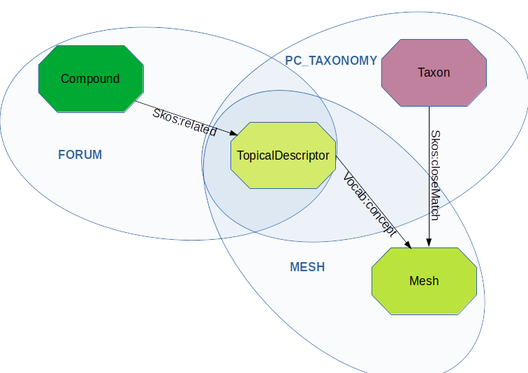

# Atelier Big Data - 10 au 12 janvier 2023 - Hadoop/Spark/RDF

## Objectifs

L'objectif de ce TP est d'intégrer puis d'utiliser des graphes de connaissances (fichier RDF) de plusieurs sources (Mesh, NCBI, FORUM) dans un DataLake et un environnement Spark/Hadoop. 

Nous utiliserons des [commandes Hadoop](https://hadoop.apache.org/docs/current/hadoop-project-dist/hadoop-common/FileSystemShell.html) pour la gestion des fichiers et nous developperons le traitement en language [scala](https://www.scala-lang.org/). 

Pour mettre au point la méthode nous utiliserons un [spark-shell](https://spark.apache.org/docs/latest/quick-start.html) puis nous developperons une application spark pour automatiser le traitement.

## Sujet

Associer un composé du projet [FORUM](https://forum-webapp.semantic-metabolomics.fr/#/about) avec un [PubChem/Taxonomy](https://pubchem.ncbi.nlm.nih.gov/source/22056) .



[Les données RDF](./databases.md)


### A - Utilisation d'un  sbt-shell pour travailler sur le jeu de données test

L'idéal est de réaliser le développement et les tests sur votre machine personnelle puis de lancer le traitement sur le cluster avec les données réelles.

Il faut se référer à la partie ["installation"](./prerequisites.md) si vous souhaitez travailler dans un envvironnement de développement personnel ou sur une machine virtuelle instanciée à partir d'un cloud académique ([orion](https://orion.cloud.inrae.fr/) ou [genostack](https://genostack.genouest.org/) par exemple).


#### Les plateformes d'exécution

- [Local/Cloud Orion/Cloud Genostack](./local.md)
- [Cluster de l'atelier](./clustertp.md)
- [Metabolomics Semantic Datalake](./msd.md)

#### Traitement sur un jeu de données test

Nous allons travailler a partir d'un jeu de données test qui se trouve dans [rdf-files-test](https://github.com/p2m2/tp-big-data-scala-spark-sansa/tree/main/rdf-files-test)


### Exécution du traitement

Avec l'utilisation de [Sansa](http://sansa-stack.github.io/SANSA-Stack/), il s'agit ici de : 

 - 1) créer un *Dataset* pour chasque fichier RDF ;
 - 2) créer un *Dataset* commun qui fussionne les trois *Datasets* ;
 - 3) exécuter une requete SPARQL sur ce dernier *Dataset* ;
 - 4) sauvegarder les resultat au format parquet sur le cluster hdfs .
  

```scala
val taxonomyPath="rdf-files-test/pc_taxonomy_test.ttl"
val meshPath="rdf-files-test/mesh_test.nt"
val assoforumChebiMesh="rdf-files-test/triples_assos_chebi_mesh_test.ttl"

import net.sansa_stack.rdf.spark.io.RDFReader
import net.sansa_stack.rdf.spark.model.TripleOperations
import org.apache.jena.graph.Triple
import org.apache.jena.riot.Lang
import org.apache.spark.sql.{Dataset, DataFrame, Encoder, Encoders}

val triplesDataset : Dataset[Triple] = spark.rdf(Lang.TURTLE)(taxonomyPath).toDS().union(spark.rdf(Lang.NT)(meshPath).toDS()).union(spark.rdf(Lang.TURTLE)(assoforumChebiMesh).toDS())

val query = """ 
PREFIX skos: <http://www.w3.org/2004/02/skos/core#>
PREFIX rdf: <http://www.w3.org/1999/02/22-rdf-syntax-ns#>
PREFIX rdfs: <http://www.w3.org/2000/01/rdf-schema#>
PREFIX owl: <http://www.w3.org/2002/07/owl#>
PREFIX meshv: <http://id.nlm.nih.gov/mesh/vocab#>
PREFIX chebi: <http://purl.obolibrary.org/obo/CHEBI_>
PREFIX mesh: <http://id.nlm.nih.gov/mesh/>

SELECT ?compound ?prop ?mesh ?taxon
WHERE {
	?compound skos:related ?descriptor .
    ?descriptor ?prop ?mesh .
    FILTER ( ?prop=meshv:concept || ?prop=meshv:preferredConcept )
    ?taxon skos:closeMatch ?mesh .
}
"""

import net.sansa_stack.ml.spark.featureExtraction.SparqlFrame
import net.sansa_stack.query.spark.SPARQLEngine

val sparqlFrame =
new SparqlFrame()
  .setSparqlQuery(query)
  .setQueryExcecutionEngine(SPARQLEngine.Sparqlify)

val resultsDF : DataFrame = sparqlFrame.transform(triplesDataset)

//Affichage
resultsDF.map( row => (row.get(0).toString,row.get(2).toString,row.get(0).toString,row.get(3).toString) ).take(1)

resultsDF.write.parquet("./results/compound_taxon.parquet")
```

#### Inspectez le resultat *./results/compound_taxon.parquet* . Combien de couples composé/taxon sont enregistrés ?

- via *ls/cat* ou *hdfs dfs -ls/cat*
- via *spark-shell / spark.read.load("./results/compound_taxon.parquet").count*

### B - Intégration du code dans une application spark

#### Connectez vous au cluster Big Data

#### Reperez les fichiers RDF sur le cluster (commande hdfs)

Les fichiers sont localisés sur le stockage hdfs dans le répertoire */rdf*.

#### Verifiez la structure des fichiers avec la command head

#### Récuperez l'archive du TP sur votre machine locale (idéalement sinon travailler directement sur le cluster)

Récuperez [l'archive template du tp](https://github.com/p2m2/tp-big-data-scala-spark-sansa/archive/refs/heads/main.zip) 

#### Intégrez dans la classe Main le traitement

#### Assemblage du Jar

```shell
sbt assembly
```

#### Générez l'assemblage du jar pour un test en local 
#### Générez l'assemblage du jar et copiez le jar sur le cluster pour un test sur le jeux de données réel

#### Inspectez le resultat *./results/compound_taxon.parquet* . Combien de couples composé/taxon sont enregistrés ?


## Liens

- [github du tp](https://github.com/p2m2/tp-big-data-scala-spark-sansa/)
- [documentation hadoop](https://hadoop.apache.org/docs/current/hadoop-project-dist/hadoop-common/FileSystemShell.html)